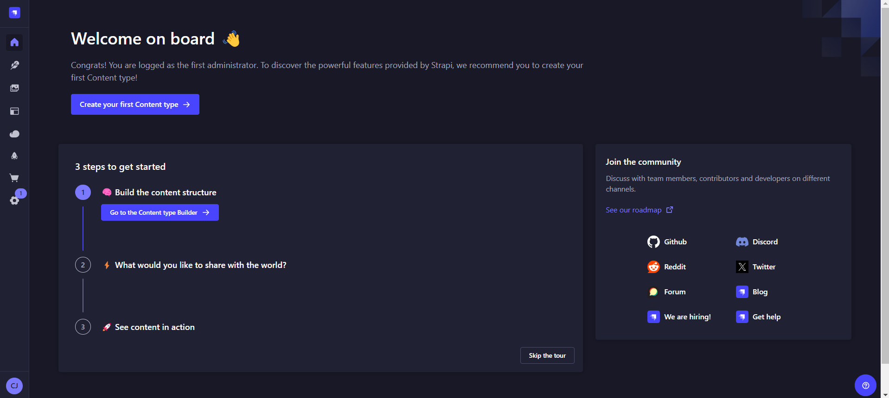
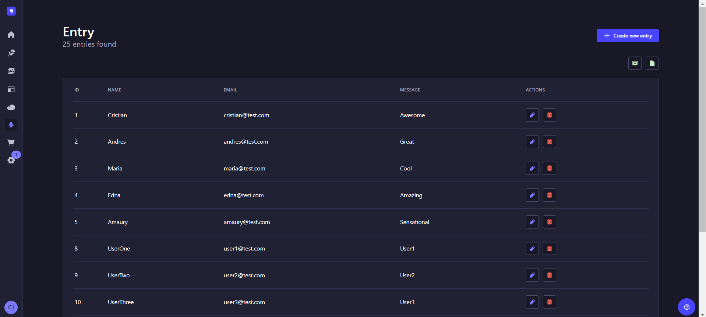

# Strapi custom plugin 🚀

This repository contains a custom plugin developed for **Stripe** called "form". The plugin integrates with Strapi's design system to ensure its components align with the overall interface of Strapi. It includes a custom form component validated by a custom hook, allowing seamless communication between the plugin and its database for content management.

Additionally, the plugin exposes an API that is consumed by an external form. The fields of this external form undergo a validation process both before submission and during data processing in the plugin's API.

Once there are records in the database, the functionality of downloading the information in the selected format between JSON and CSV is offered.

## Features

- **Custom Form Component**: The plugin includes a dynamic form component built with Strapi's design system.
- **Custom Hook Validation**: A custom hook is implemented to validate the form fields before data submission.
- **API Integration**: The plugin communicates with its database via an API, which is also consumed by an external form.
- **Field Validation**: Both internal and external forms validate the data through strict rules before processing in the API.
- **Data Download**: You can download the plugin's data as JSON or CSV file.

## Technologies Used

- **Strapi**: Headless CMS for simplify and optimize content management in web and mobile applications.
- **Strapi Design System**: A UI component library for creating amazing Strapi extensions.
- **React**: JavaScript library for building user interfaces.
- **Vite**: A fast development build tool for modern web projects.
- **react-toastify**: Notifications for your app with ease.

## Installation

1. Clone the repository:

   ```bash
   git clone https://github.com/Cristianjs93/strapi-form-plugin.git
   ```

2. Navigate to the project directory:

   ```bash
   cd strapi-form-plugin
   ```

3. Install the dependencies:

   ```bash
   npm install
   ```

## Usage

1. Run the application:

   ```bash
   npm run develop
   ```

2. Open your browser and navigate to:

   ```
   http://localhost:1337/admin
   ```

3. Upon first run, Strapi will prompt you to create an administrator account. You will see a form to create a new admin user. Fill in the required fields.

4. After submitting the form, you will be logged into the Strapi Admin Panel.

## Environment

Follow the `.env.example` file to add the required variables.

## Screenshots


_*Admin creation From*_

<br/>


_*Strapi admin panel*_

<br/>


_*Custom plugin home page*_

<br/>


_*Management form with error response*_

## Contributing

If you would like to contribute to this project, please fork the repository and submit a pull request. Any contributions, whether improvements or bug fixes, are welcome!

## License

This project is licensed under the MIT License.
